# 北大炒股讲座 - 第 1章：概述
# 北大炒股PPT
## 页面 1

### 文本内容
地震概论
Outreach of Intro to Selismology
炒股挣钱 地震概论 2026 春季学期
---
## 页面 2
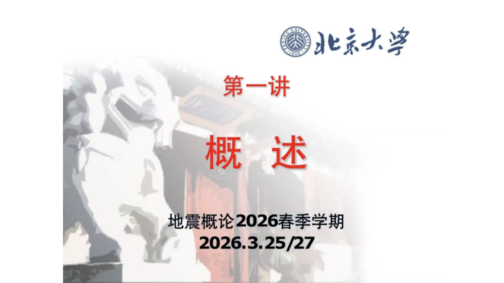
### 文本内容
地震概论 第一讲 概述 地震概论 2026 春季学期
2026.3.25/27
---
## 页面 3
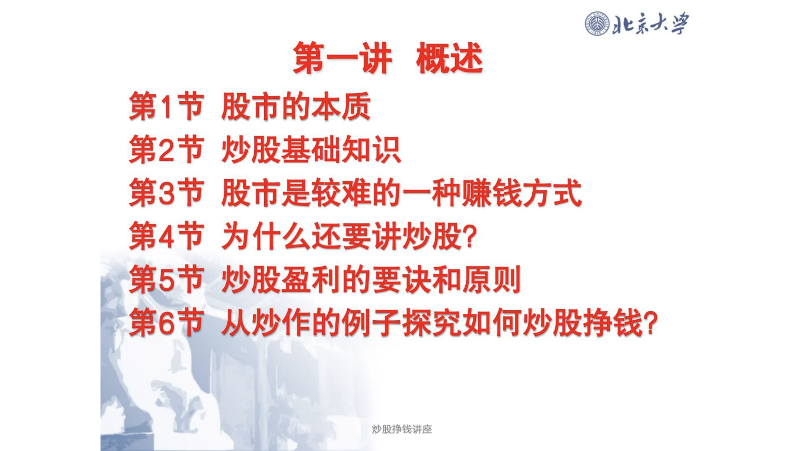
### 文本内容
地震概论第一讲概述第1节 股市的本质第2节 炒股基础知识第3节 股市是较难的一种赚钱方式第4节 为什么还要讲炒股?
第5节 炒股盈利的要诀和原则第6节从炒作的例子探究如何炒股挣钱?
炒股挣钱讲座
---
## 页面 4
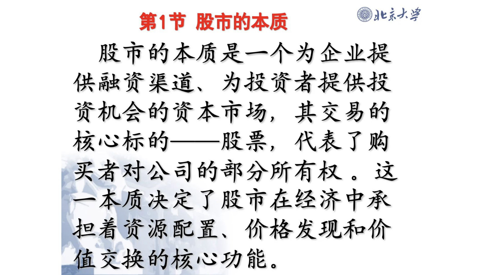
### 文本内容
地震概论第1节 股市的本质股市的本质是一个为企业提供融资渠道。为投资者提供投资机会的资本市场,
其交易的核心标的--股票,
代表了购买者对公司的部分所有权。这一本质决定了股市在经济中承担着资源配置价格发现和价值交换的核心功能。
---
## 页面 5
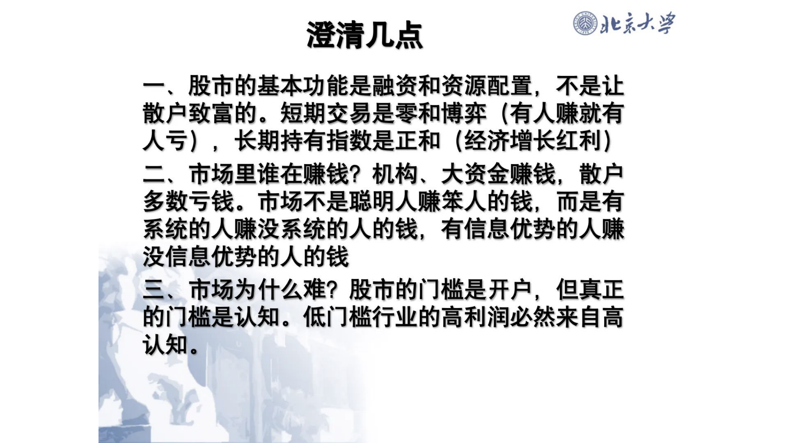
### 文本内容
地震概论澄清几点股市的基本功能是融资和资源配置,
不是让
散户致富的。短期交易是零和博弈 (有人赚就有人亏)
长期持有指数是正和
(经济增长红利)
二市场里谁在赚钱? 机构大资金赚钱;
散户多数亏钱。市场不是聪明人赚笨人的钱,
而是有系统的人赚没系统的人的钱有信息优势的人赚没信息优势的人的钱三市场为什么难? 股市的门槛是开户，但真正的门槛是认知。低门槛行业的高利润必然来自高认知
---
## 页面 6
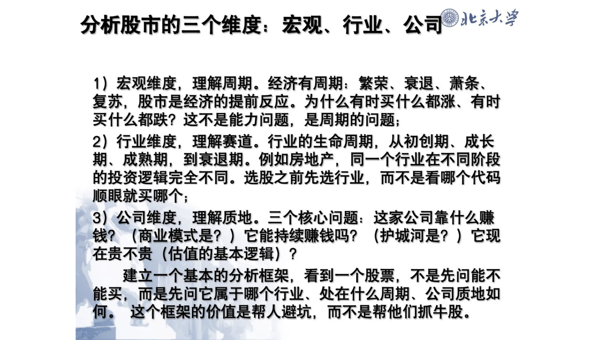
### 文本内容
分析股市的三个维度:
宏观行业公司地震概论
1) 宏观维度,
理解周期。经济有周期:
繁荣。衰退萧条
复苏。股市是经济的提前反应。为什么有时买什么都涨。有时买什么都跌? 这不是能力问题;
是周期的问题;
2) 行业维度。理解赛道。行业的生命周期,
从初创期。成长期成熟期,到衰退期。例如房地产同一个行业在不同阶段的投资逻辑完全不同。
选股之前先选行业,
而不是看哪个代码顺眼就买哪个;
3) 公司维度,
理解质地。三个核心问题:
这家公司靠什么赚钱?
(商业模式是? )它能持续赚钱吗?
(护城河是? )它现在贵不贵
(估值的基本逻辑)
?
建立一个基本的分析框架;
看到一个股票,
不是先问能不能买而是先问它属于哪个行业处在什么周期.
公司质地如何。
这个框架的价值是帮人避坑;
而不是帮他们抓牛股。
---
## 页面 7
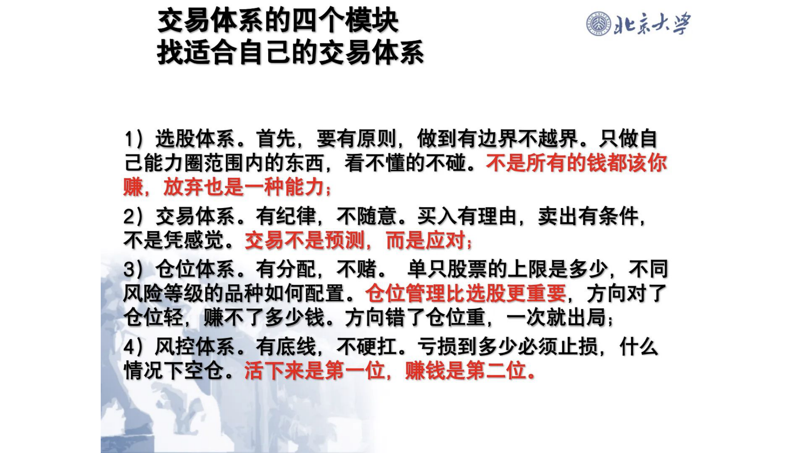
### 文本内容
交易体系的四个模块地震概论找适合自己的交易体系
1) 选股体系。首先,
要有原则,
警惕有边界不越界。
只做自己能力圈范围内的东西，
看不懂的不碰。不是所有的钱都该你赚放弃也是一种能力;
2) 交易体系。有纪律,
不随意。买入有理由,
卖出有条件,
不是凭感觉。交易不是预测,
而是应对;
3) 仓位体系。有分配不赌。
单只股票的上限是多少,
不同风险等级的品种如何配置=
仓位管理比选股更重要,
方向对了仓位轻;
赚不了多少钱。方向错了仓位重,
一次就出局;
4) 风控体系。有底线,
不硬扛。亏损到多少必须止损,
什么情况下空仓。活下来是第一位；
赚钱是第二位。
---
## 页面 8
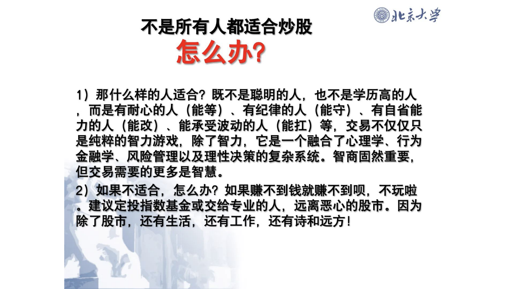
### 文本内容
地震概论不是所有人都适合炒股怎么办?
1) 那什么样的人适合? 既不是聪明的人,
也不是学历高的人而是有耐心的人 (能等)
有纪律的人
(能守)
有自省能力的人 (能改)
能承受波动的人 (能扛)
等。交易不仅仅是纯粹的智力游戏，
除了智力。它是一个融合了心理学。行为金融学.
风险管理以及理性决策的复杂系统。智商固然重要;
但交易需要的更多是智慧。
2) 如果不适合,
怎么办? 如果赚不到钱就赚不到呗,
不玩啦
建议定投指数基金或交给专业的人,远离恶心的股市。因为除了股市,
还有生活还有工作。还有诗和远方 !
---
## 页面 9
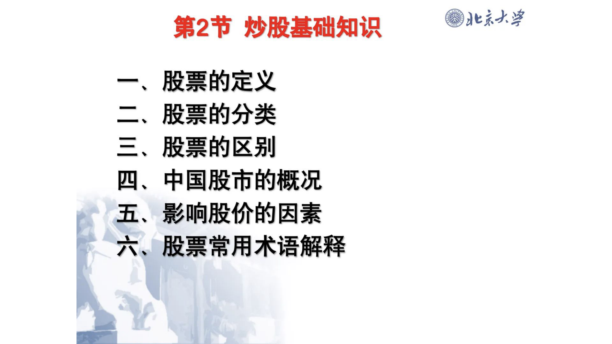
### 文本内容
第2节 炒股基础知识地震概论股票的定义股票的分类三股票的区别四中国股市的概况五.
影响股价的因素六。股票常用术语解释
---
## 页面 10
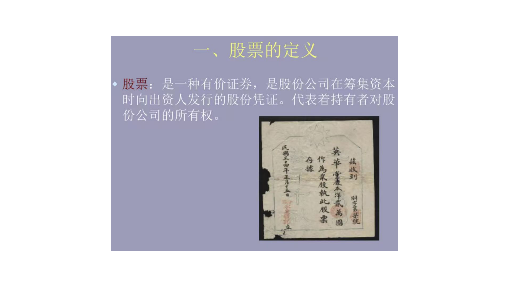
### 文本内容
股票的定义股票: 是一种有价证券,
是股份公司在筹集资本
时向出资人发行的股份凭证。代表着持有者对股^
份公司的所有权。
英作
[
瘃蓊黛黧
---
## 页面 11
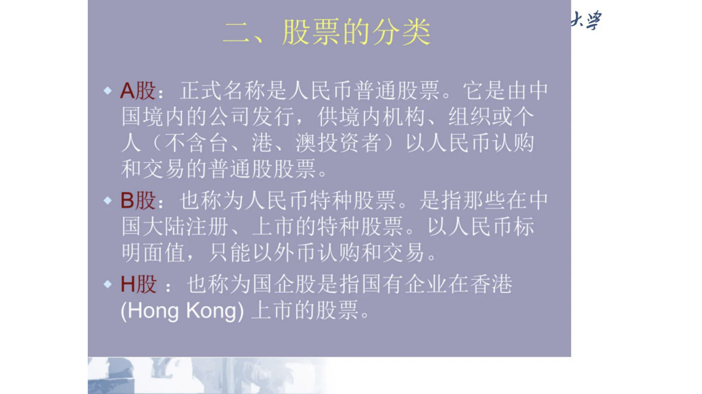
### 文本内容
火挲二`股票的分类
A股:
正式名称是人民币普通股票。
它是由中国境内的公司发行,供境内机构。组织或个人 (不含台。港。澳投资者 )
以人民币认购和交易的普通股股票
B股: 也称为人民币特种股票
0
是指那些在中国大陆注册,
上市的特种股票。
以人民币标明面值,
只能以外币认购和交易。
H股 :也称为国企股是指国有企业在香港^
(Hong Kong) 上市的股票
---
## 页面 12
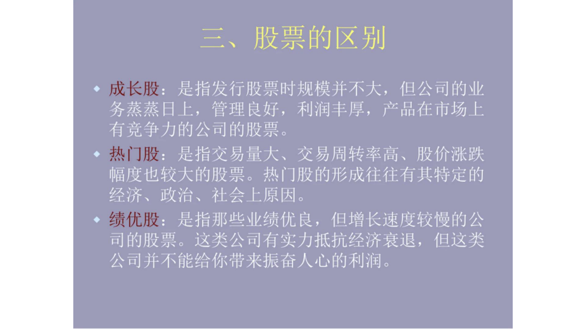
### 文本内容
三`股票的区别成长股:
是指发行股票时规模并不大,
但公司的业务蒸蒸目上;
管理良好,
利润丰厚;产品在市场上^
有竞争力的公司的股票。
热门股: 是指交易量大`交易周转率高。股价涨跌
幅度也较大的股票。热门股的形成往往有其特定的经济。政治。社会上原因。
绩优股:
是指那些业绩优良,但增长速度较慢的公司的股票。这类公司有实力抵抗经济衰退,
但这类公司并不能给你带来振奋人心的利润。
---
## 页面 13
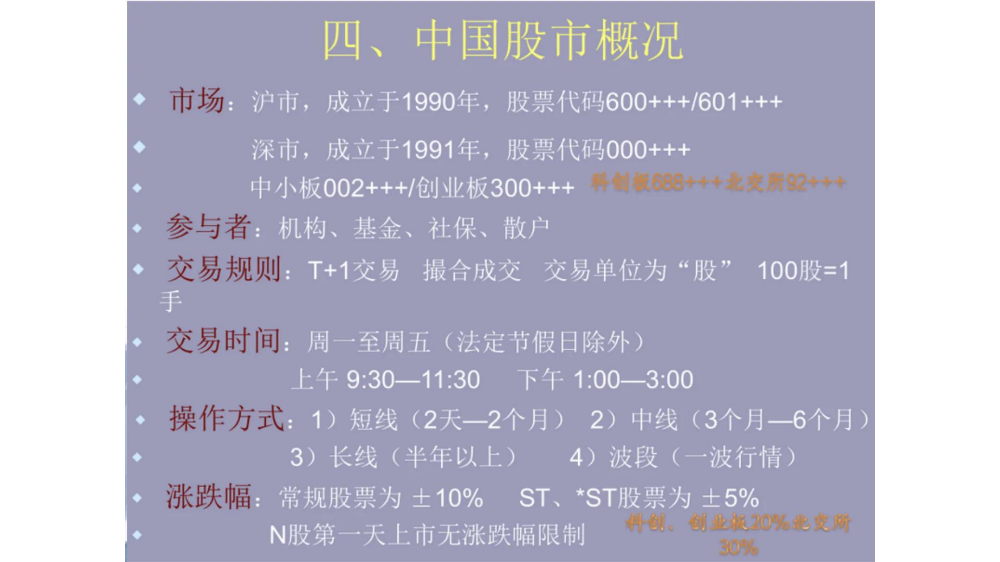
### 文本内容
四`中国股市概况市场:
沪市,
成立于1990年;
股票代码600+++1601++ +
深市。成立于1991年;股票代码000+++
中小板002+++1创业板300+++
拜创鬟688+4+北交所92++膏参与者:机构。基金。社保。散户交易规则:
T+1交易撮合成交交易单位为 《股"
100股1
手
交易时间: 周-至周五 (法定节假日除外 )
上午9:30-11:30
下午1:00--3:00
操作方式:
1) 短线 (2天2个月)
2)中线 (3个月-6个月 )
3)长线 (半年以上 )
4)波段 (一波行情)
涨跌幅常规股票为士10%
ST
*ST股票为 士5%
卅@
{坐魉20%髦D腑
N股第-天上市无涨跌幅限制
J
---
## 页面 14
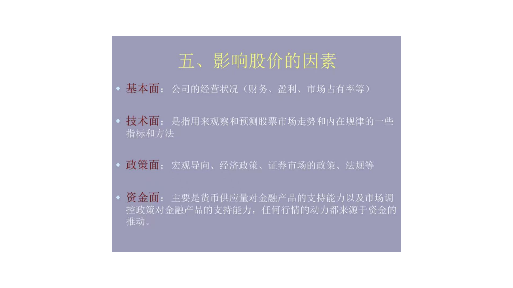
### 文本内容
五`影响股价的因素基本面:
公司的经营状况 (财务盈利。市场占有率等)
技术面:
是指用来观察和预测股票市场走势和内在规律的一些指标和方法政策面:
宏观导问。经济政策。证券市场的政策。法规等资金面:
主要是货币供应量对金融产品的支持能力以及市场调
控政策对金融产品的支持能力。任何行情的动力都来源于资金的推动。
---