# 北大炒股讲座 - 第 2章：炒股基础
## 页面 15
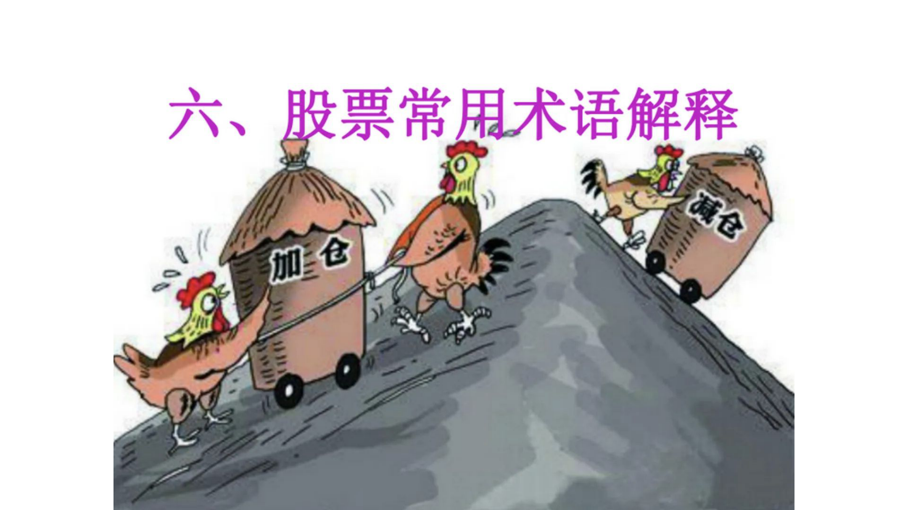
### 文本内容
六;股票常厢术语解释
@
C
B仓怔仓
---
## 页面 16
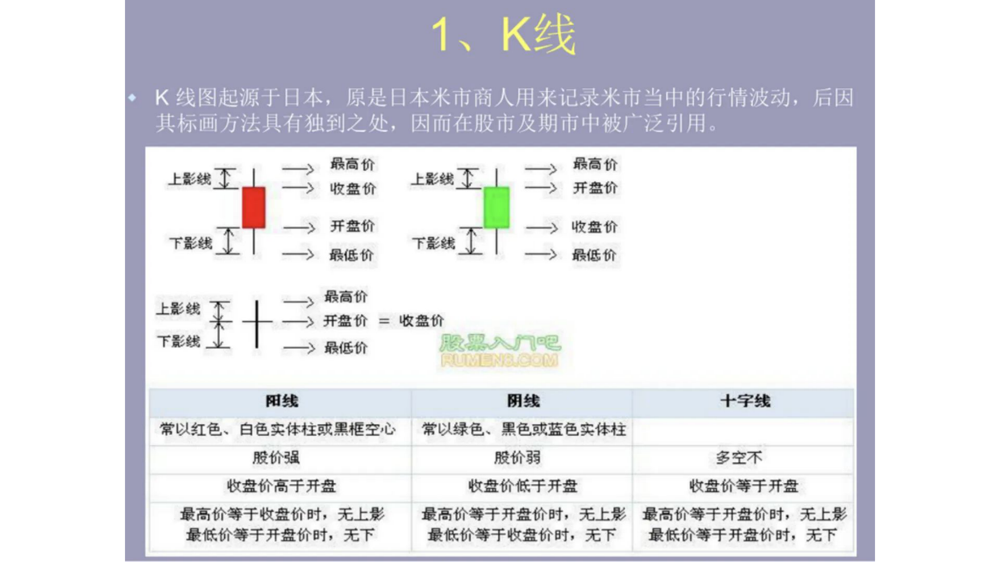
### 文本内容
1
人线
K 线图起源于日本。原是日本米市商人用来记录米市当中的行情波动后因其标画方法具有独到之处,
而在股市及期市中被广泛引用。
)
最高价
>
最裔价上影线上影线小收盘价
`
开盘价
>
开盘价
>
收盘价下影线下影线最低价
〉
最低价最高价上影戥十开盘价
=
收盘价下影线
〉最低价
Rmi qe
N
网线用线十字线常以红色曰色实体柱或黑框空常以绿色。黑色或蓝色实体柱股价强胺价弱多空不收盘价高于开盘收盘价低于开盘收盘价等于开盘最高价等于收盘价时。无上影最高价等于开盘价时。无上影最高价等干开盘价时。无上影最低价等干开盏价时。无下最低价等干收盘价时。无下最低价等干开盘价时。无下
---
## 页面 17
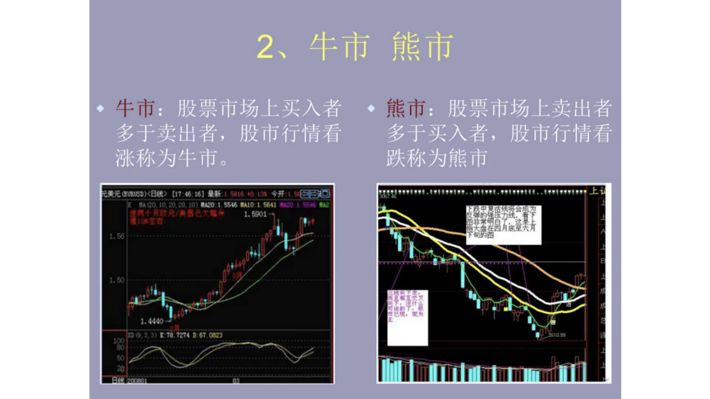
### 文本内容
2,
牛市 熊市牛市: 股票市场上买入者熊市: 股票市场上卖出者多于卖出者;
股市行情看多于买入者,股市行情看涨称为牛市。
跌称为熊市
元]元UUD)〈BH〉 [17.46 {6] 鼻r
UANU | 5546 MNI0
9
1.5901
奖#盟曷月
00
旬[
14p0
1.4450
「 io 7374167 0
09
108
20
』
---
## 页面 18
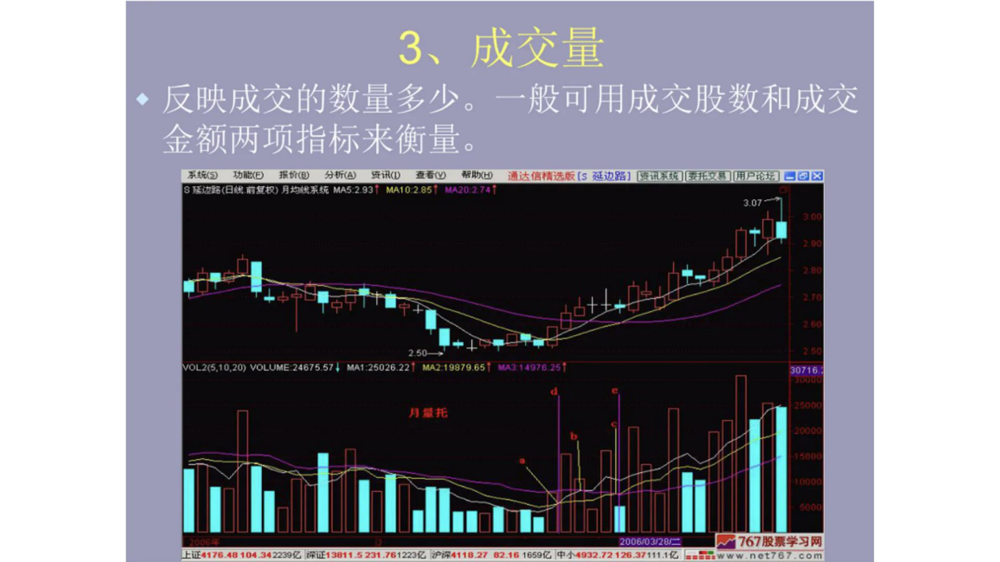
### 文本内容
3,成交量反映成交的数量多少。
一般可用成交股数和成交金额两项指标来衡量。
尕 (5)
Di(
Atr(8)
AtC)
sA(
石0
JI(U
逦达悖惰|及 [5 延边跆]
S 廷边%(曰 前《权)月均系统 MAS 2931
MA10 285-02027
3.07
+1帖宁
250
VOL2(5.10.20) VOLUME 24675.57
N41.25026.22
4421987965
34go
30716
N
2006/031281
767股票学习网
止正4176-48104.34223901证13811.5231.7612230F14118.27
82.1616590 $44932.72126.37111.12
not767
COI
---
## 页面 19
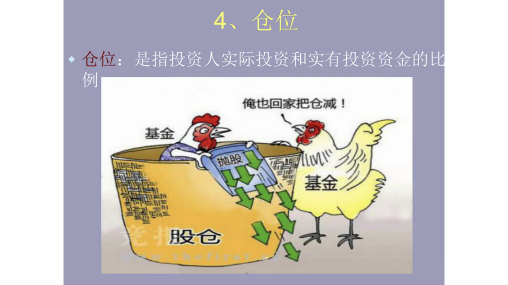
### 文本内容
4`
仓位仓位:
是指投资人实际投资和实有投资资金的比例俺也回家把仓减 !
基金基金_
股仓
IM
抛股
$
---
## 页面 20
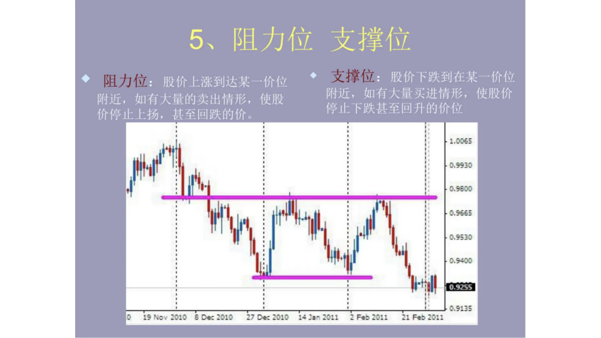
### 文本内容
5
阻力位支撑位阻力位:
股价上涨到达某一价位支撑位:
股价下跌到在某一价位附近; 如有大量的卖出情形。使股^
附近;如有大量买进情形;使股价^
价停止上扬,甚至回跌的价。
停止下跌甚至回升的价位
5
0330
0.550
055
0.,530
00
0.9255
03
?
3121
27 2021
512021
 F
21F2'
---
## 页面 21
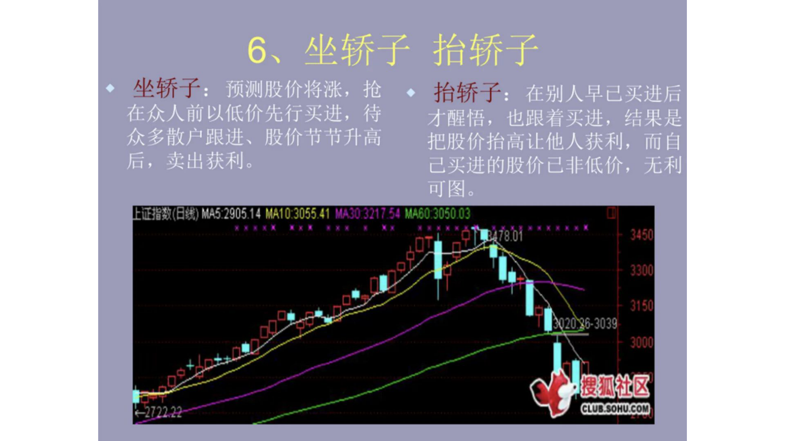
### 文本内容
G
坐轿子 抬轿子坐轿子:
预测股价将涨。抢抬轿子:
在别人早己买进后在众人前以低价先行买进。待才醒悟,也跟着买进。结果是众多散户跟进。股价节节升高把股价抬高让他人获利,
而自后,卖出获利己买进的股价己非低价, 无利可图
}猾(M2905.14M13412ol60g
0478.01
75
33叫
45
002086.3039
0O
燮区
272222
CUBSONUCO
8
---
## 页面 22
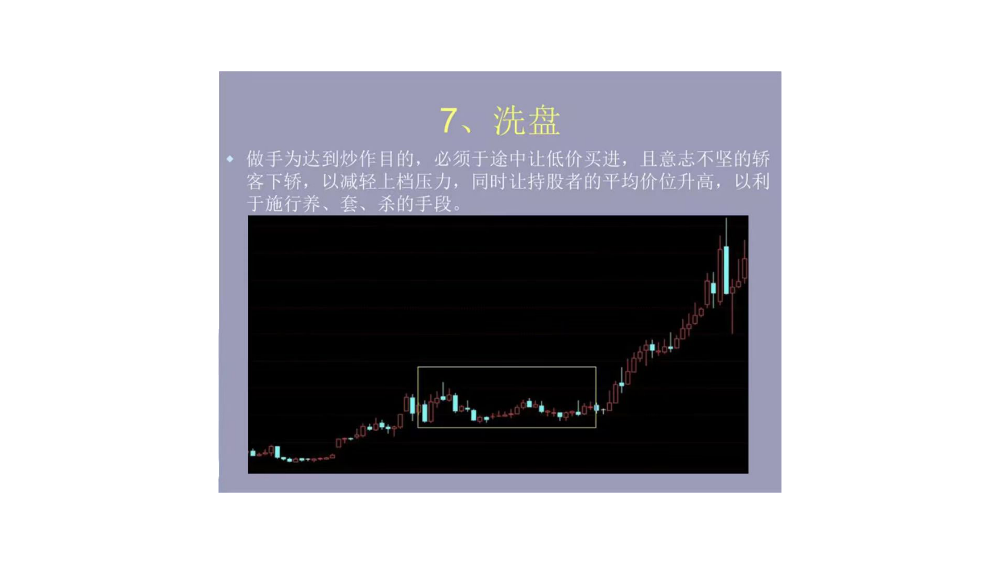
### 文本内容
7,洗盘做手为达到炒作目的。必须干途中让低价买进;
且意志不坚的轿
客下轿。以减轻上档压力。同时让持股者的平均价位升高,
以利于施行养 套杀的手段。
40+
141
---
## 页面 23
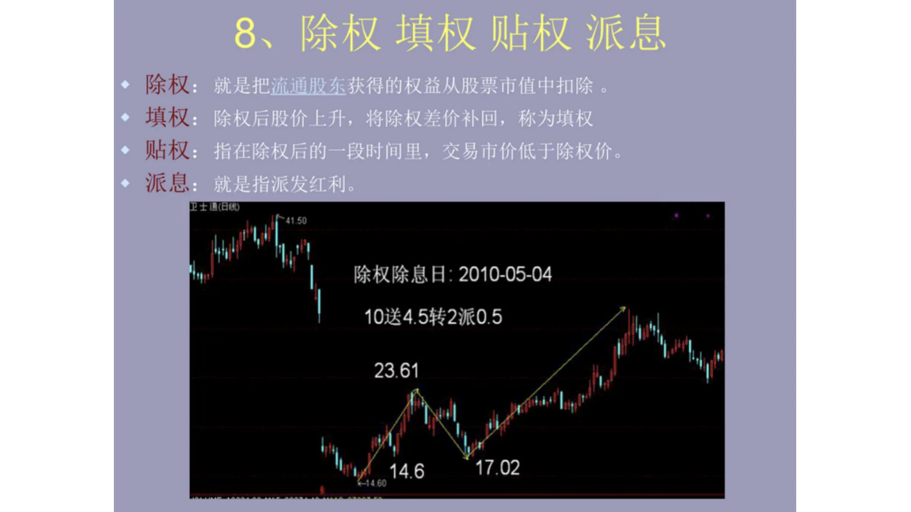
### 文本内容
8,除权填权贴权派息除权:
就是把逾通股东获得的权益从股票市值中扣除
填权: 除权后股价上升;将除权差价补回。称为填权
贴权: 指在除权后的一段时间里;交易市价低于除权价。
派息:
就是指派发红利。
4150
除权除息日:2010-05-04
10送4.5转2派0.5
23.61
14.6
17.02
60
---
## 页面 24
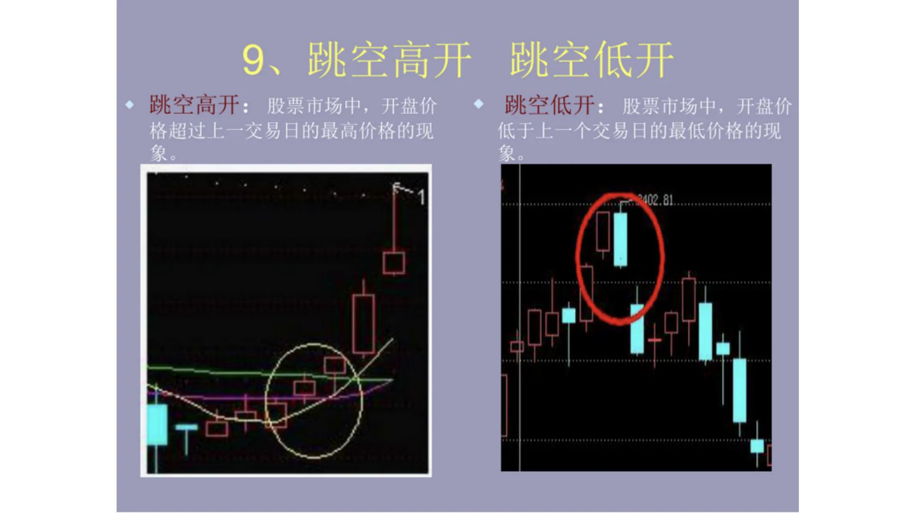
### 文本内容
9 跳空高开跳空低开跳空高开:
股票市场中。开盘价跳空低开:
股票市场中;开盘价格超过上一交易目的最高价格的现低于上一个交易目的最低价格的现^
象。
象。
02.81
---
## 页面 25
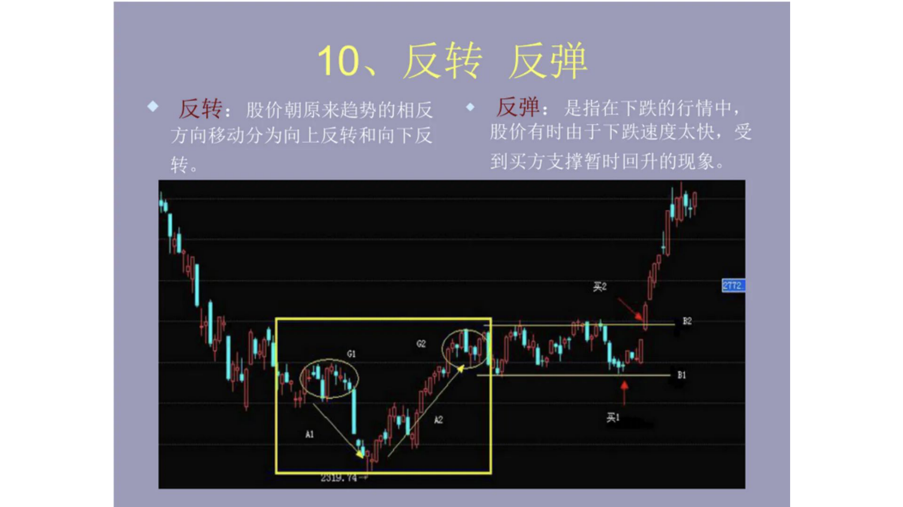
### 文本内容
10,
反转 反弹反转: 股价朝原来趋势的相反反弹: 是指在下跌的行情中,
方问移动分为向上反转和向下反股价有时由于下跌速度太快;受转。
到买方支撑暂时回升的现象。
2112
[
A。
---
## 页面 26
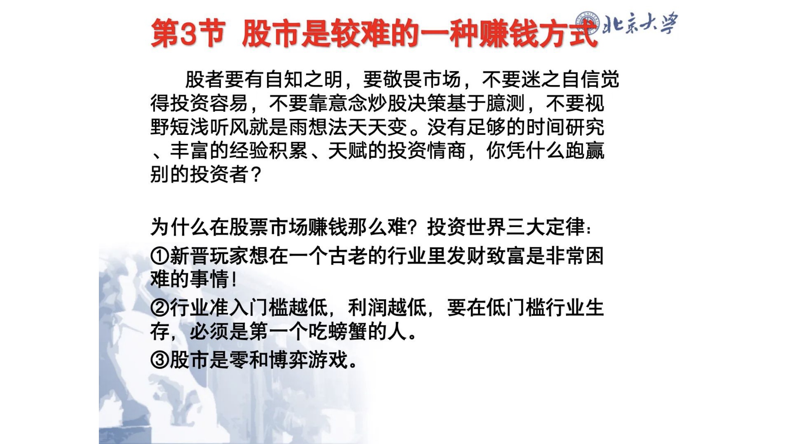
### 文本内容
第3节 股市是较难的一种赚钱方式』为紧股者要有自知之明 ,
要敬畏市场不要迷之自信觉得投资容易不要靠意念炒股决策基于臆测,
不要视
野短浅听风就是雨想法天夭娈。没有足够的时间研究
丰富的经验积累。夭赋的投资情商,你凭什么跑赢别的投资者?
为什么在股票市场赚钱那么难? 投资世界三大定律:
@新晋玩家想在一个古老的行业里发财致富是非常困难的事情 !
@行业准入门槛越低,
利润越低,
要在低门槛行业生存,
必须是第一一个吃螃蟹的人。
@股市是零和博弈游戏。
---
## 页面 27
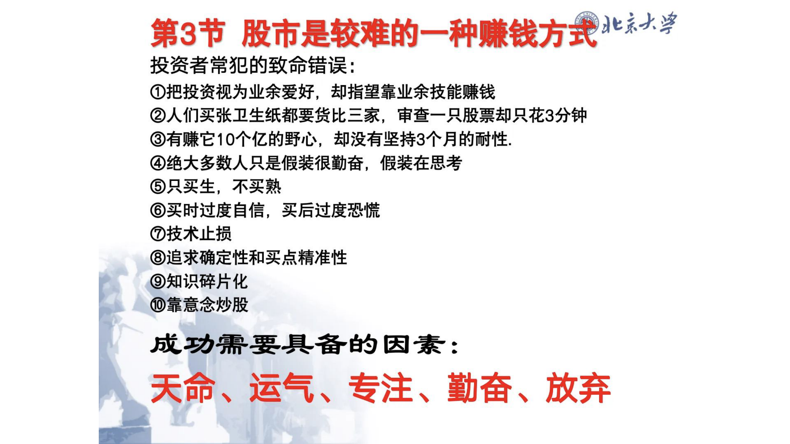
### 文本内容
第3节 股市是较难的一种赚钱方式兆紧投资者常犯的致命错误:
0把投资视为业余爱好;
却指望靠业余技能赚钱
@人们买张卫生纸都要货比三家审查一只股票却只花3分钟
有赚它10个亿的野心,却没有坚持3个月的耐性。
绝大多数人只是假装很勤奋,
假装在思考
@只买生,
不买熟买时过度自信,
买后过度恐慌技术止损
@追求确定性和买点精准性
@知识碎片化
@靠意念炒股成功需要具备的因素:
夭命运气专注。勤奋放弃
---
## 页面 28
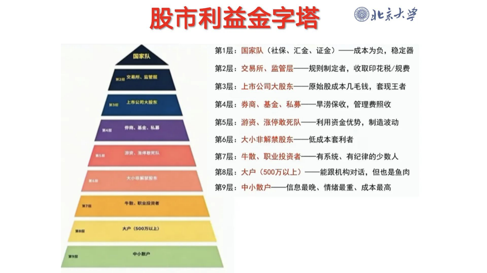
### 文本内容
股市利益金字塔地震概论第1层: 国家队 (社保:
汇金证金)-一成本为负;稳定器
ORI
第2层: 交易所。监管层一一规则制定者。收取印花税/规费
RUM。UA
第3层: 上市公司大股东一一原始股成本几毛钱;套现王者
LANAA
第4层: 券商。基金。私募-一旱涝保收。管理费照收第5层: 游资。涨停敢死队
-利用资金优势,制造波动
4
k
第6层: 大小非解禁股东
~低成本套利者
4
第7层: 牛散。职业投资者-
有系统。有纪律的少数人第8层: 大户 (500万以上)
能跟机构对话,但也是鱼肉
@1翻蟀第9层: 中小散户信息最晚。情绪最重成本最高
4N41g
A (00U)
NNn
---
## 页面 29
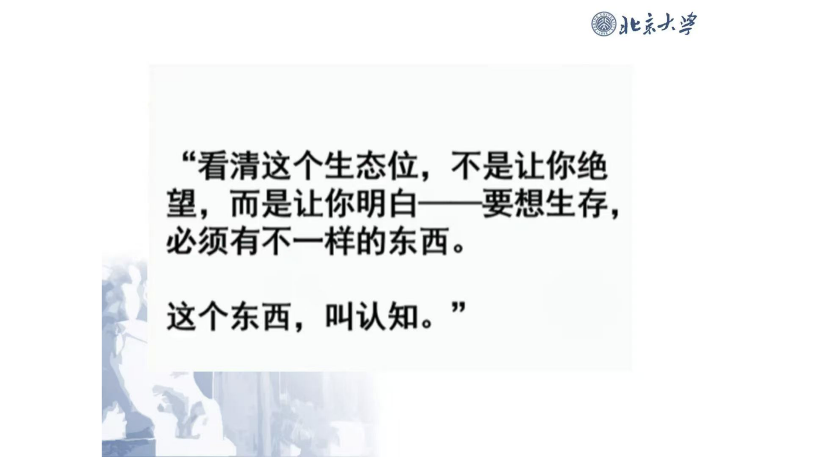
### 文本内容
地震概论
"看清这个生态位,
不是让你绝望而是让你明白一要想生存;
必须有不一样的东西。
91
这个东西,
叫认知。
---