# 北大炒股讲座 - 第 3章：交易体系
## 页面 30

### 文本内容
地震概论我们是金字塔的底层。不是顶层。
这意味着我们不可能拥有信息优势资金优势。制度优势
0
所以。不要试图用信息去和信息优势者对抗;
不要试图用资金去和资金优势者对抗。
你唯一的优势可能是时间。耐心 可以花精力去了解规律井保持对规律的敬畏
---
## 页面 31
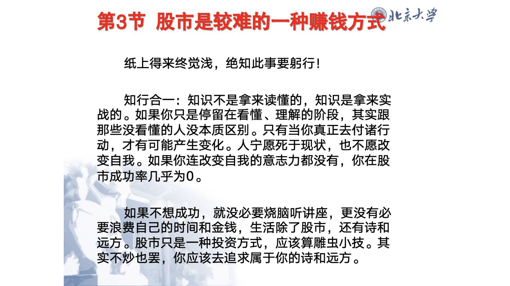
### 文本内容
第3节股市是较难的一种赚钱方式蛮4紧纸上得来终觉浅,绝知此事要躬行!
知行合一：知识不是拿来读懂的知识是拿来实战的战的。如果你只是停留在看懂。理解的阶段其实跟
那些没看懂的人没本质区别。只有当你真正去付诸行动,才有可能产生娈化。人宁愿死于现状,
也不愿改
变自我。如果你连改娈自我的意志力都没有,你在股市成功率几乎为0。
如果不想成功就没必要烧脑听讲座,
更没有必要浪费自己的时间和金钱,
生活除了股市,
还有诗和远方。股市只是种投资方式,
应该算雕虫小技。其实不炒也罢,你应该去追求属于你的诗和远方。
---
## 页面 32
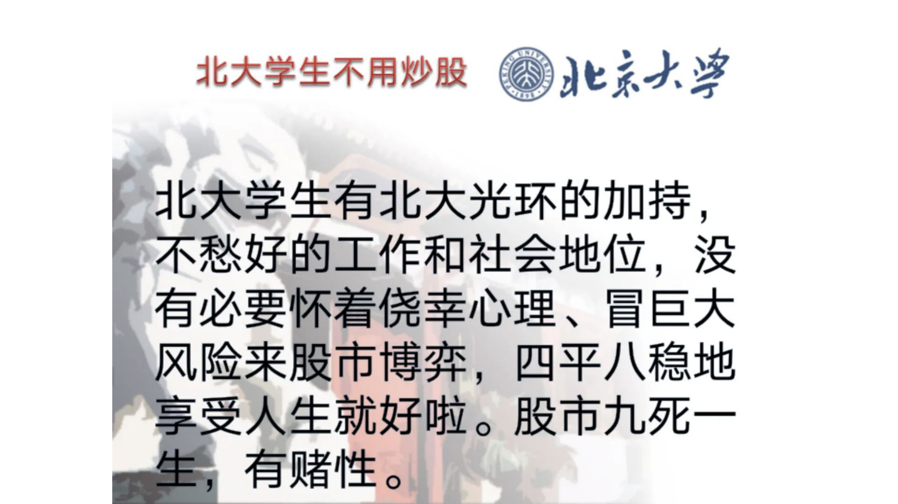
### 文本内容
北大学生不用炒股兆京火掌北大学生有北大光环的加持
9
不愁好的工作和社会地位。没有必要怀着侥幸心理冒巨大风险来股市博弈,
四平八稳地享受人生就好啦。
股市九死一生;
有赌性。
---
## 页面 33
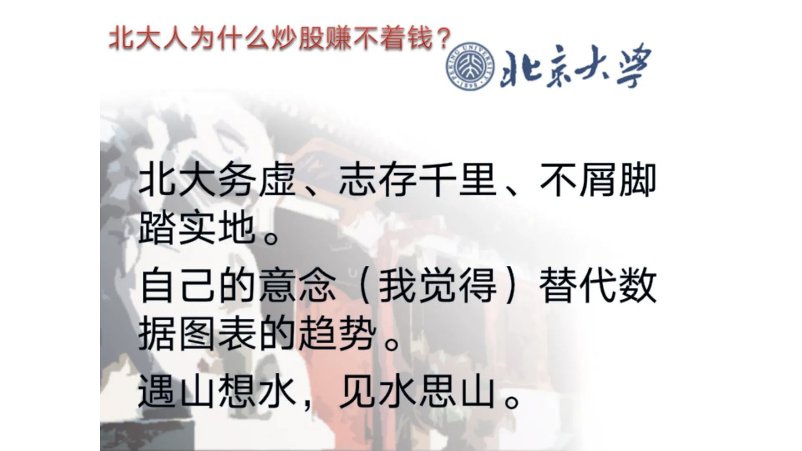
### 文本内容
北大人为什么炒股赚不着钱?
京火挲北大务虚志存千里不屑脚踏实地。
自己的意念 (我觉得)
替代数据图表的趋势。
遇山想水
9
见水思山
0
---
## 页面 34

### 文本内容
名人炒股例子地震概论蒋中正马克思丘吉尔牛顿杰西利维摩尔爱因斯坦论股市
(炒过没有? )
---
## 页面 35

### 文本内容
地震概论第4节 股市有风险。为什么还要讲炒股?
通识教育的要求人生基本知识的必备
三 提升投资理财意识 (参考《穷爸爸富爸爸》
小狗钱钱推荐 )
《财富自笛乏路》) ,银行跑不赢通胀
不错过一次财务自由的机会 (万一你夭命注定)
m
事实: 所有富人都正面亏损 ,
穷人很难承受亏损六。炒股也是一个智力游戏,类似围棋 -
桥牌和国际象(跳)棋。股市定律:
一盈二平七亏损。即只有百分之十的人盈利。
---
## 页面 36
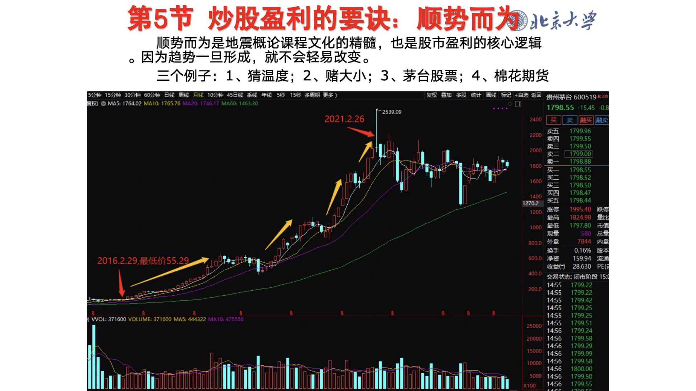
### 文本内容
第5节 炒股盈利的要诀顺势而为北京火紧
顺势而为是地震概论课程文化的精髓,也是股市盈利的核心逻辑因为趋势一旦形成,就不会轻易改娈。
三个例子: 1。猜温度; 2。赌大小; 3
茅台股票; 4。棉花期货
15分钟 15分钟 30分钟 60分钟 日筅 周筅 月浅 10分j 458浅 幸浅年线
5秒
15秒多屑期鹌)
昱权叠 宰殿 统计固筅
T记 +自远 讴回贵州茅台 600519Rs00
昃忉
MAS: 176402 N1410: 1765.76M0-577M460;1463.30
1798.55 -15.45
0.0
2539.09
2021.2.26
2400
>
1799.96
3200
1799.55
2000
卖三爨
179950
179900
卖
1798.88
1800
1798.55
1600
燹
179853
1798.47
1400
蟊
1798.44
1270.2
1200
张停
199540
跌i
最高
182498
2
41000
最低
1797.80
市值现量
580
总量宁
800.0
外盘
7844
内盘换手
0.169
股
2016.2.29,最低价55.29
600.0
洚资
159.94
流通收益6
28.630
PE(
44000
35
交易状态:闭市阶段15
14.55
1799.22
200.0
14:55
1799.22
14:55
1799.42
14:55
1799.25
14:55
1799.25
WOL 371600 VOLUME: 371600 MAS: 44432210475556
25000
14.55
1799.51
14:56
1799.24
20000
14:56
1799.58
14:56
1799.29
15000
14:56
1799.99
10000
14:56
1799.58
14:56
1800.00
SOOO 14:56
1799.50
X100
14:56
1799.55
0
0005
---
## 页面 37
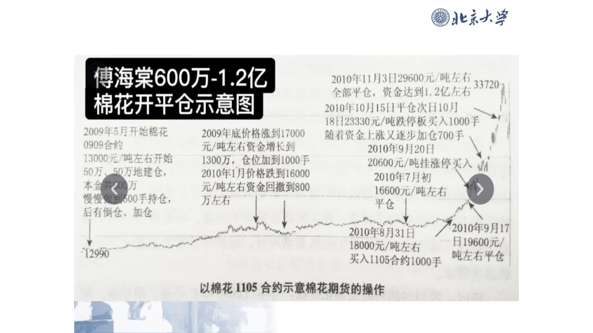
### 文本内容
地震概论傅海棠600万-1.2亿
2010年[月31129600兀/盹左133720
个部'仓。资金达到1.2亿左右棉花开平仓示意图
2010介10川11511'仓次410月
181123330兀/吨跌停板买入1000干
2009年5月开始榀花
2009年底价格涨到17000
随仔资企 |:湫又逐步加仓700干
0909合约元/吨左右资金增长到
2010年911201
13000元(吨左右开始
1300万,仓位加到1000于
20600兀/吨挂涨停买入
50万
50万地建仓;
2010年1月价格跌到16000
驯
2010年7月初本金共200万元/吨左右资金回撤到800
16600元/盹左右慢慢敝3800手持仓,
万左右平仓后有倒仓。加仓
2010年8月318
2010年9月17
18000元/吨左右日19600元 /
12990
买入1105合约1000手盹右右平仓以棉花 I105 合约示意棉花期货的操作
』
---
## 页面 38
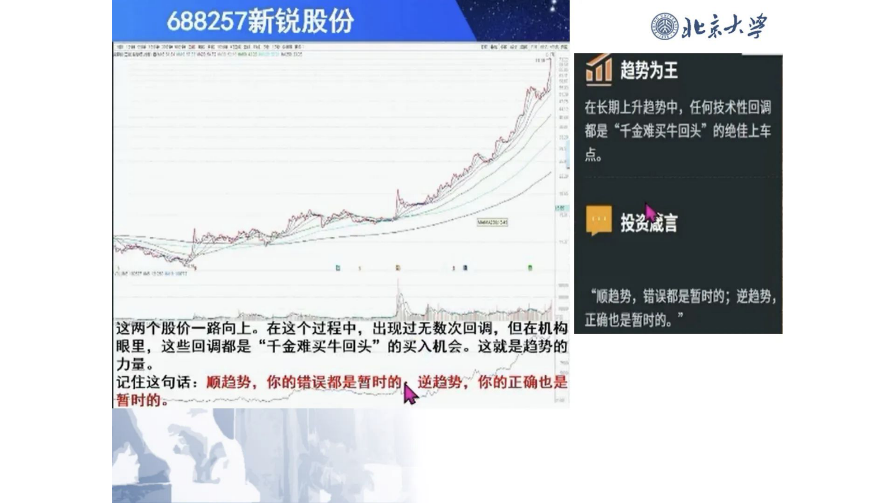
### 文本内容
688257新锐股份地震概论趱饪在长期上升趋势中。任何技术性回凋都是 *千金难买牛回头" 的绝佳上车点。
撄资赢
*顺趋势;错误都足暂时的; 逆趋势;
这两个股价一路向上。在这个过程中。出现过无数次回调。但在机构正确也足暂时的。
[眼里,这些回调都是 "千金难夹牛回头" 的头入机会。这就是趋势的力昂。
记住这句话: 顺趋势。你的错误都是暂肘的逆趋势;你的正确也是暂时的。
---
## 页面 39
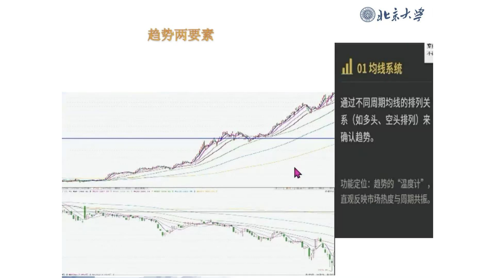
### 文本内容
兆系火挲趋势两要素山01均线系统通过不同周期均线哟排列关系 (如多头 空头排列) 来确认趋势。
功定位: 趋势的 "温度计直反市场热度与 共振
---
## 页面 40
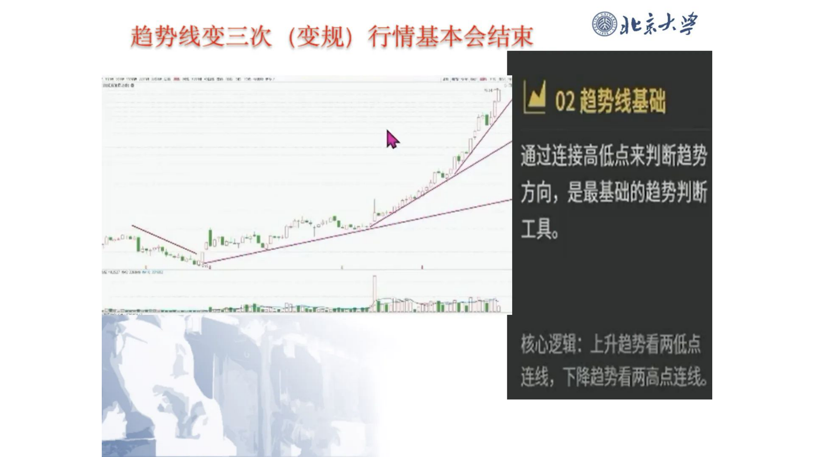
### 文本内容
地震概论趋势线变三次
(变规)
行情基本会结束
02趋势线基础通过连接高低点来判断趱势方向;是基础的趋势判断|
o
[
工具桫逻辑: 上升趋势看两傩点连线;下降趋势看两高点连线。
9
---
## 页面 41
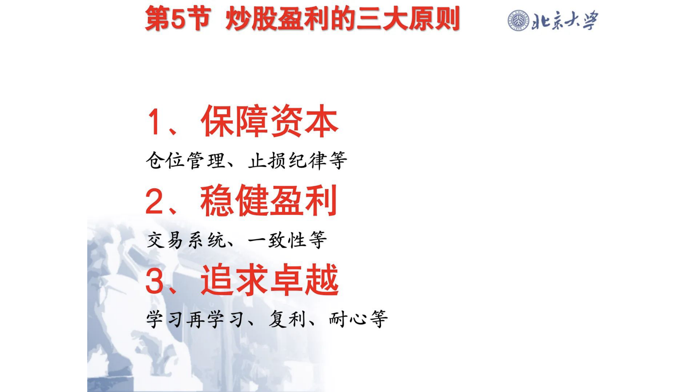
### 文本内容
第5节 炒股盈利的三大原则地震概论
1。保障资本仓位管理,
止损纪律等
2。稳健盈利交易系统 -致性等
3.
追求卓越学习再学习复利耐心等
---
## 页面 42
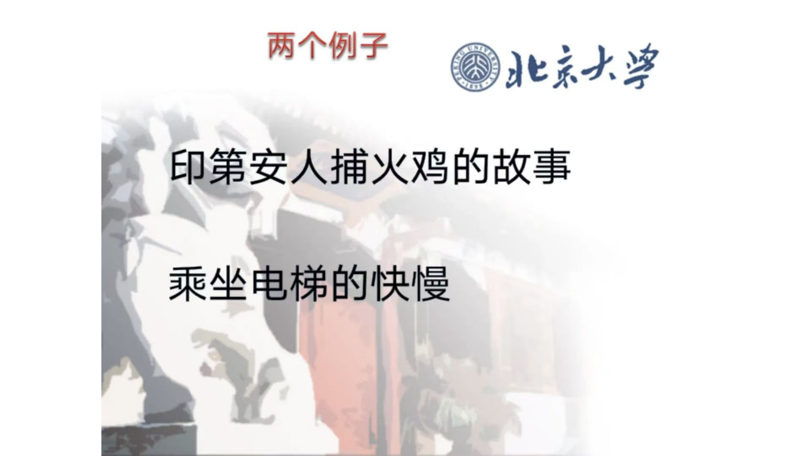
### 文本内容
两个例子兆京火掌印第安人捕火鸡的故事乘坐电梯的快慢
---
## 页面 43
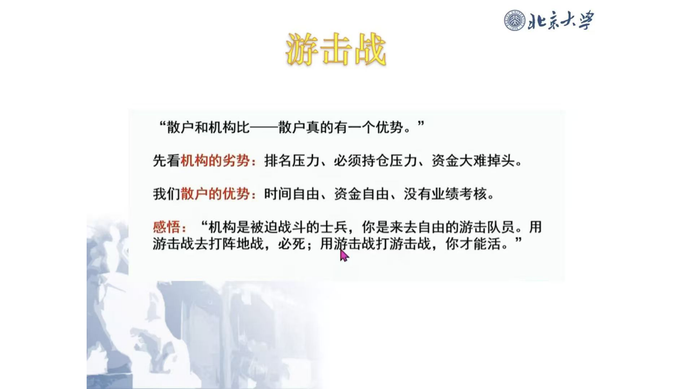
### 文本内容
兆系火挲游击战
91
"散户和机构比散户真的有一个优势。
先看机构的劣势: 排名压办必须持仓压力。资金大难掉头。
我们散户的优势: 时间自由。资金自由。没有业绩考核。
感悟:
"机构是被迫战斗的士兵。你是来去自由的游击队员。用
11
游击战去打阵地战。必死; 用游击战打游击战。你才能活。
---
## 页面 44
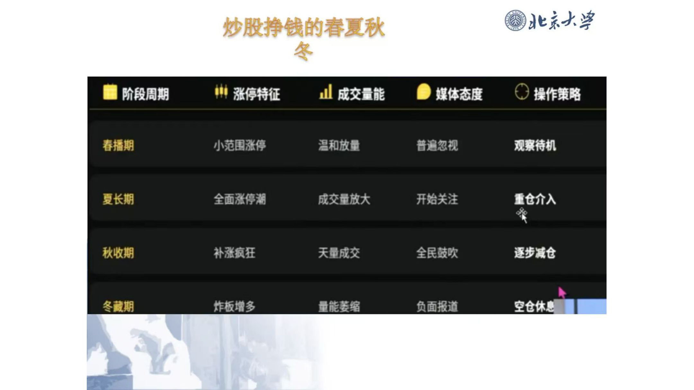
### 文本内容
炒股挣钱的春夏秋兆系火挲冬阶段周期涨停.征山成交量能媒体态度操作策略舂播期小范围张停渴和放量暂逭忽视观察待机夏长期全面张停潮成交量放大开始关注重仓介入秋收期补张疯狂天成爻全鼓吹逐步臧仓冬薮期炸板熘多量能菱绾负面报道空仓休思
---