# 北大炒股讲座 - 第 4章：实战应用
## 页面 45

### 文本内容
四大炒股挣钱法则地震概论法则一: 仓位管理
>
选股能力口诀:
首次开仓永远不满仓,
永远有预备队"
实操: 334仓位法。
30%底仓
(压舱石)
30%机动
(做波段)
40%现金
(等机会)
---
## 页面 46
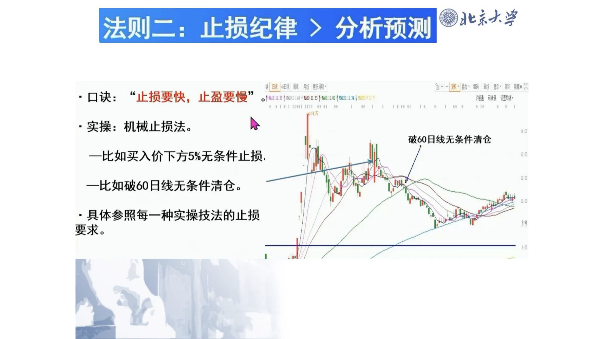
### 文本内容
地震概论法则二:
止损纪律 >分析预测乐 |.
脓 彰醐'
r
l
口诀:
'止损要快;
止盈要慢
WIg Ml
Ll
Il
l
实操: 机械止损法。
Il
破60日线无条件清仓比如买入价下方5%无条件止损
Il
比如破60日线无条件清仓。
具体参照每一种实操技法的止损要求。
---
## 页面 47

### 文本内容
地震概论法则三:
逻辑验证
〉
消息内幕
(
9
口诀:
听消息买;
必须眼见实实操:
买入三问
0
一问: 为什么涨?
(逻辑)
一问:
谁在买?
(资金)
一问: 还能涨吗?
(空间)
---
## 页面 48

### 文本内容
兆京火掌法则四:
等待>操作口诀: 等待是一种美德:
4一年虽做几波,
1
但一定提高成功率,
看不懂的时候看戏。
数据: 80%的收益来自20%的时间
0
记住: 机会大于能力。
记住:
"股市不关门,机会天天有。钱亏
9
完了就真的完了。
机会+能力=成功之路
(炒股挣钱)
---
## 页面 49

### 文本内容
第6节 从炒作的例子探究如何炒股挣钱?
地震概论
1.
中国科传601858
2.
大众交通600611
3.
长白山603099
---
## 页面 50
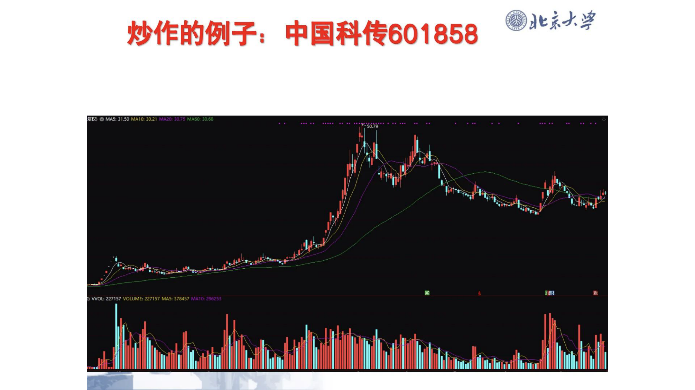
### 文本内容
地震概论炒作的例子:
中国科传601858
炱权
MA5: 31.50 MA10: 30.21。3075 MAG0: 3068
VOL: 227157 VOLUME: 227157N45: 378457440104200251
---
## 页面 51
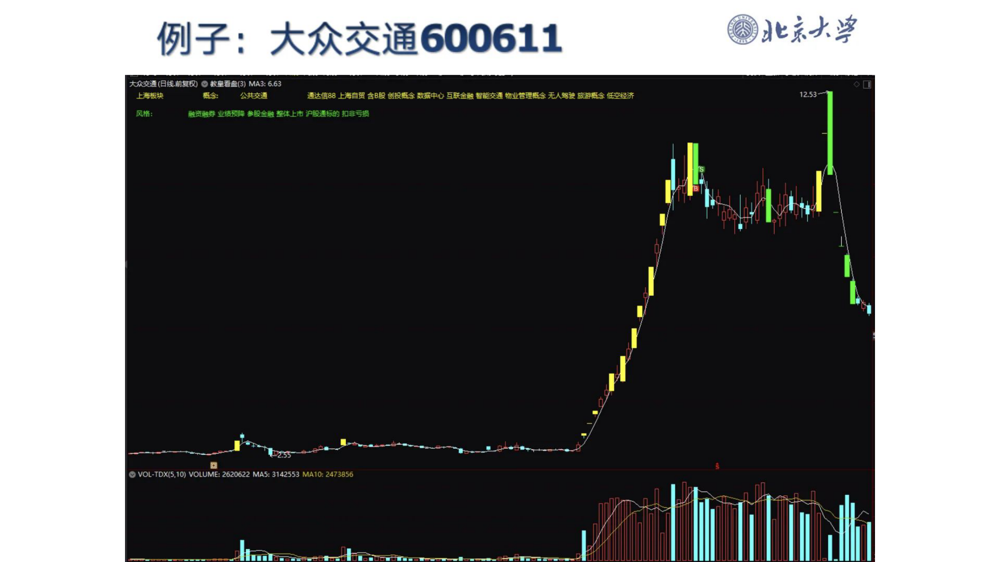
### 文本内容
例子: 大众交通600611
地震概论
大众交遁(曰浅前复枫) @ 校毫看盘(3) MA3: 6.63
上海柝坎令公共交w
濡达信88 上污C贸 合8段 剖投恶令教撂? 互戌会玳 智能交 '物业笞理擐无人骂驻 旅菥楔合任空经济
12.53
凤棺:
s贷耻养 业绩顷硭 *段全驶垄什上古 沪段逋祆的 扣非亏员
VOL-TDX(S, 10) VOLUME: 2620622 M45: 3142553 M410: 2473856
---
## 页面 52
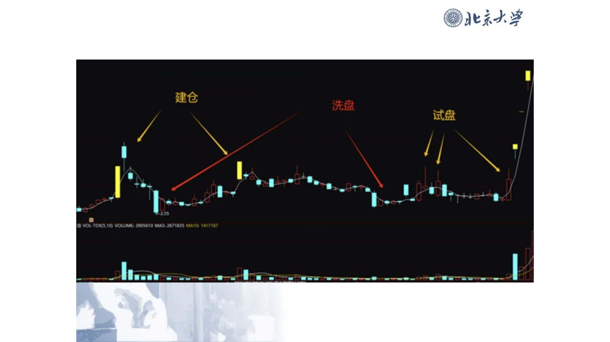
### 文本内容
地震概论建仓洗盘试盘
aos Ogmsr0c57
---
## 页面 53
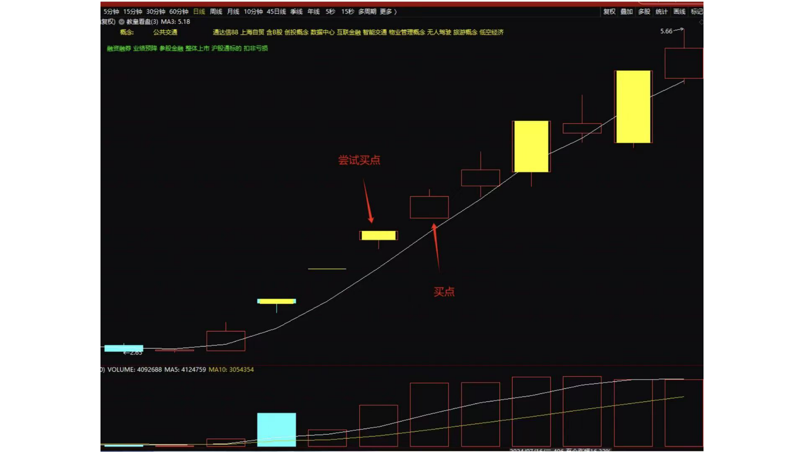
### 文本内容
本页为示意图内容，OCR 文本已省略，请参见页面图片。

---
## 页面 54
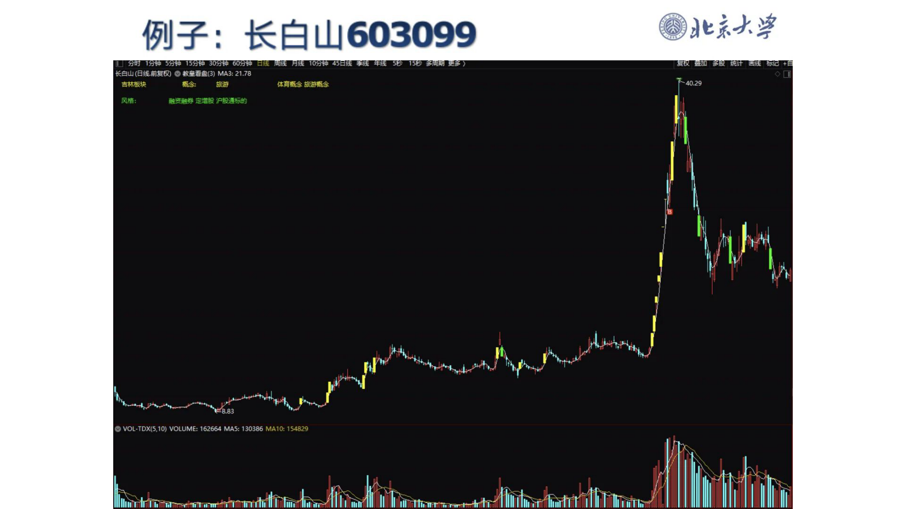
### 文本内容
本页为示意图内容，OCR 文本已省略，请参见页面图片。

---
## 页面 55
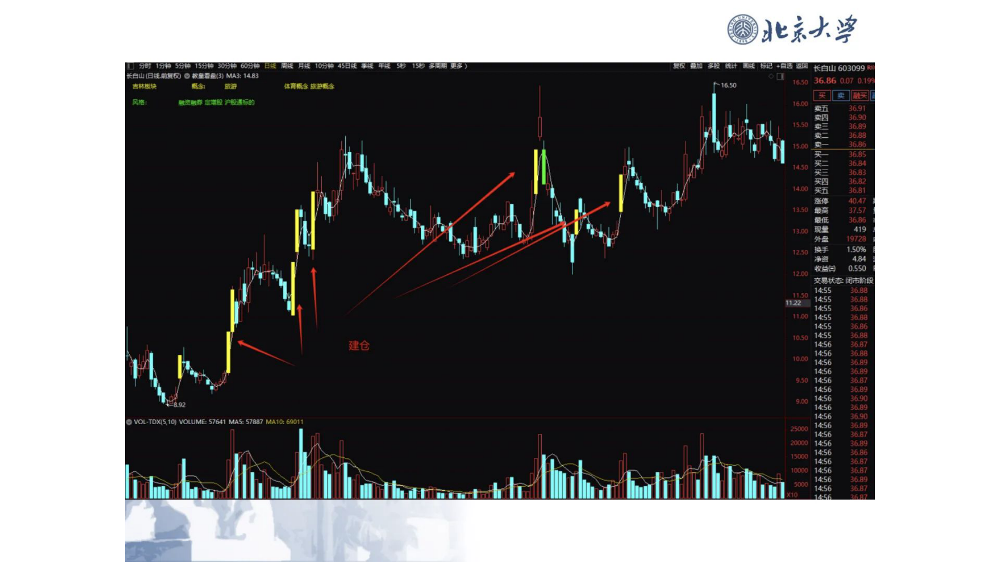
### 文本内容
本页为示意图内容，OCR 文本已省略，请参见页面图片。

---
## 页面 56
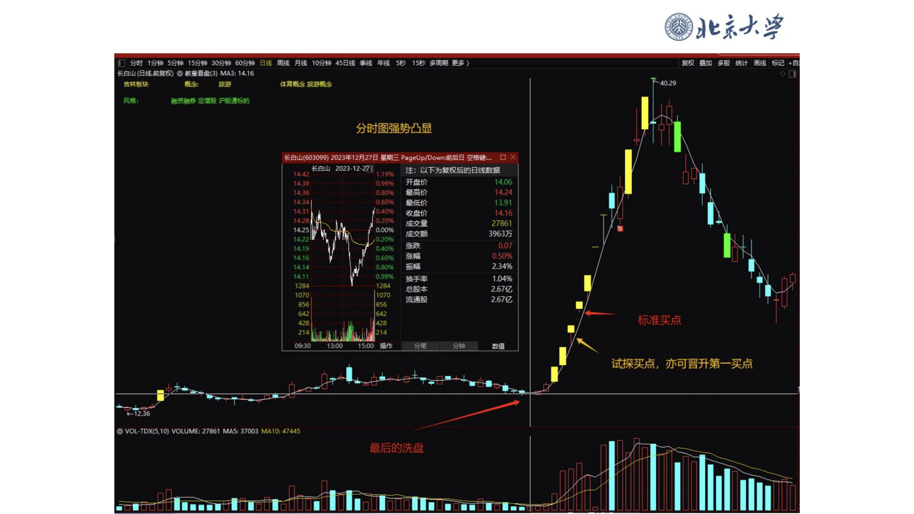
### 文本内容
本页为示意图内容，OCR 文本已省略，请参见页面图片。

---
## 页面 57
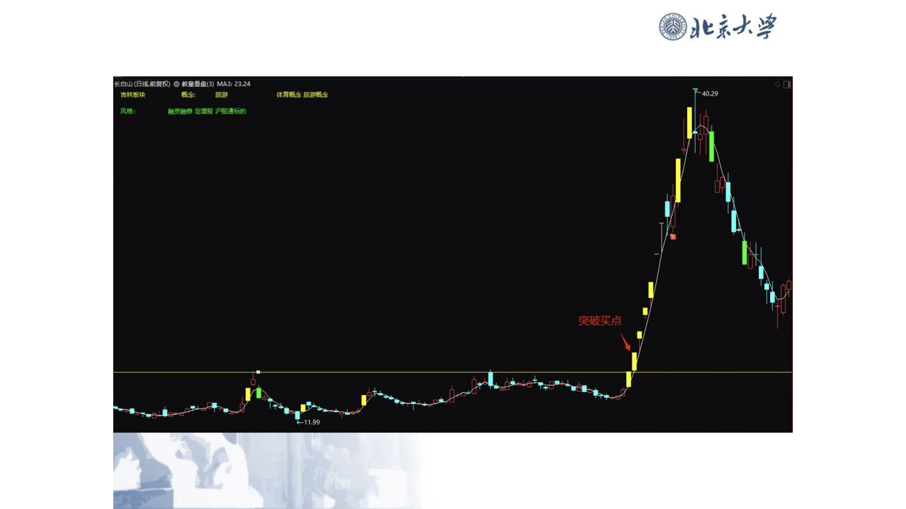
### 文本内容
本页为示意图内容，OCR 文本已省略，请参见页面图片。

---
## 页面 58

### 文本内容
炒股挣钱的核心要点：一板定热点、二板定龙头、找主线、深度研究。
---
## 页面 59
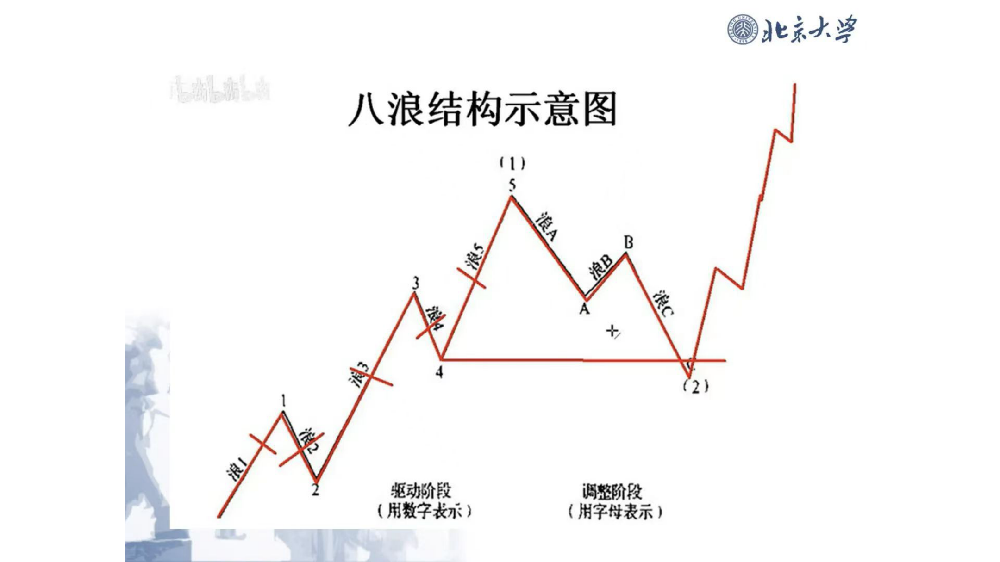
### 文本内容
本页为示意图内容，OCR 文本已省略，请参见页面图片。

---
## 页面 60
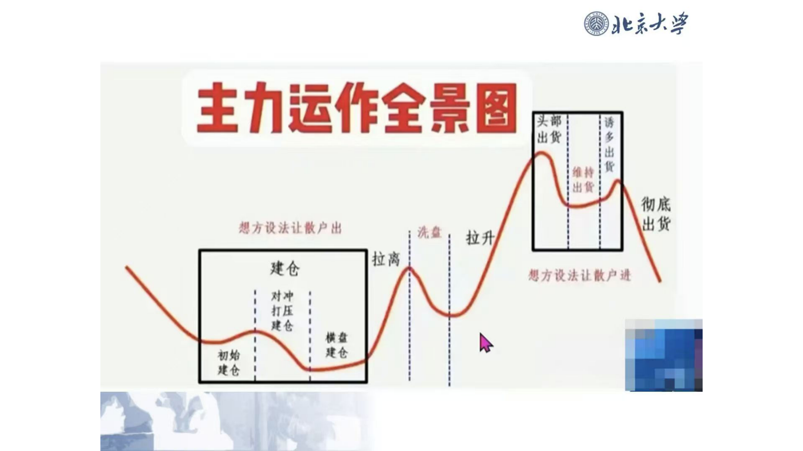
### 文本内容
本页为示意图内容，OCR 文本已省略，请参见页面图片。

---
## 页面 61
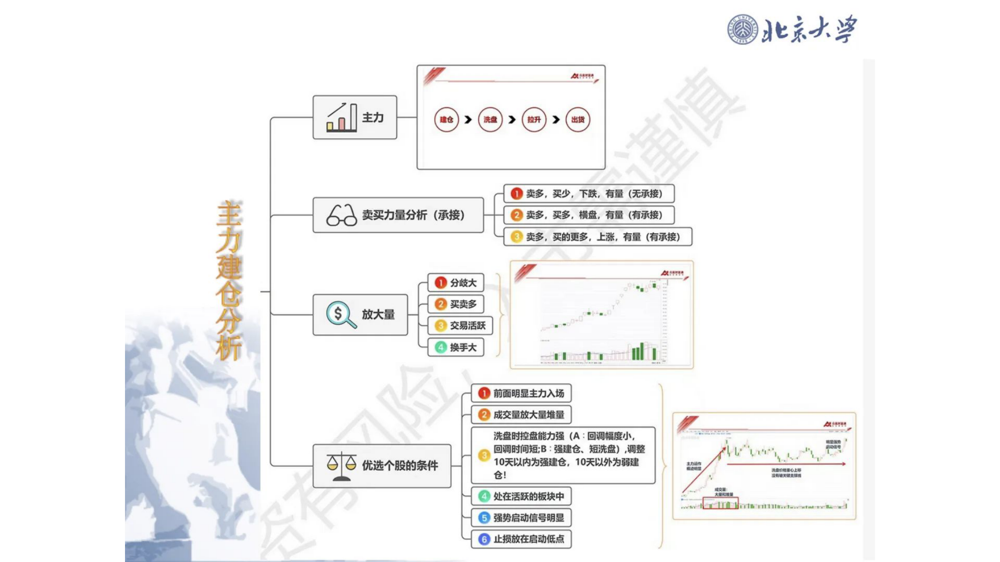
### 文本内容
本页为示意图内容，OCR 文本已省略，请参见页面图片。

---
## 页面 62

### 文本内容
炒股挣钱讲座的逻辑和模式：此涨停板得主力者得天下，寻找主力、跟随主力。
---
## 页面 63

### 文本内容
炒股挣钱讲座的目标：分析结构、理解主力意图，只做主升浪。
---
## 页面 64

### 文本内容
炒股挣钱的密码：虚心好学、成为稀缺；名师指路、贵人相帮；把握机遇、持续学习；打造核心竞争力、少走十年弯路，借力成就未来。
---